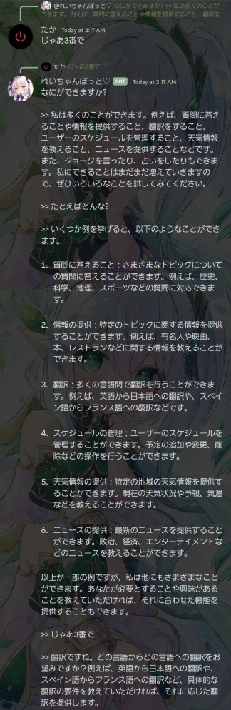

# Discord-ChatGPT-Bot
#### Discordで本格的に会話を続けられるGPT APIを使ったBotです
セットアップは簡単、DiscordBotのトークンとChatGPTのトークンを入れるだけ！  
  
#### Botの動作
[gpt質問] で会話を始められます  
そのままリプライして質問するとリプライ元のメッセージを読み込んでGPTに回答をリクエストします  
コンテキストメニューもあってメッセージに対して使うとそのままそのメッセージをGPTに送信します  
質問の末尾に" -d" (スペース必須) をつけるとリプライ元のメッセージを削除します  
会話が増えるとどんどん長くなるからコンパクトにできていいかも？  
ちなみに">> " (スペース必須) で区切って質問を認識しているので、ChatGPTの返答部分を自分で変えてそのまま[gpt質問]のとこに放り込めばGPTの返答を偽装できます  
##### 動作例
GPTとの会話例  
    
コンテキストメニューコマンド  
     
ChatGPTの返答を自分で作って放り込む  

#### なにかあったら (なくてもOK～ なんとなく入るとか話したいとか)
サーバー  
https://discord.gg/aSyaAK7Ktm  
僕のDiscord -> .taka.  
